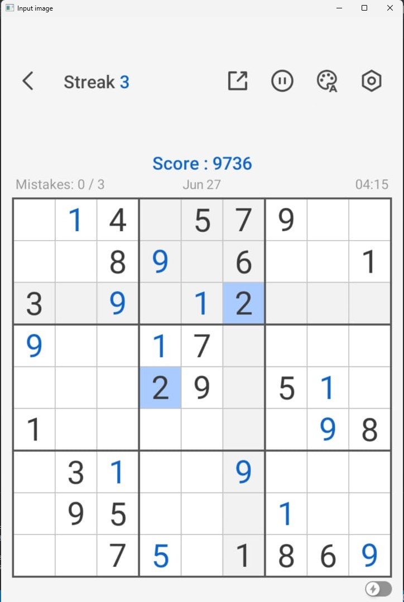
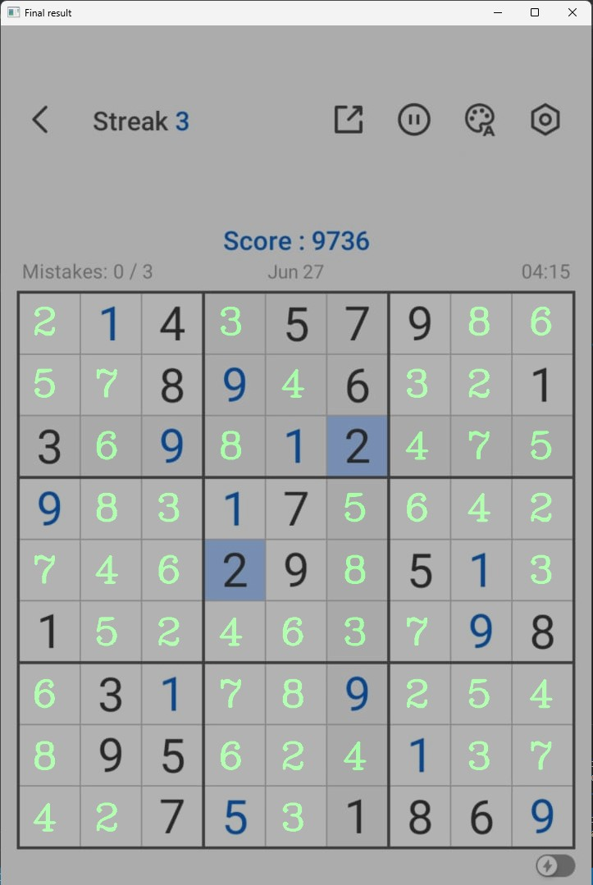

# Sudoku Solver

## Overview

The Sudoku Solver is an advanced Python application designed to solve Sudoku puzzles directly from images. Leveraging cutting-edge Optical Character Recognition (OCR) and image processing techniques, the solver accurately detects, interprets, and solves Sudoku grids, providing fast and reliable results. This tool is ideal for both casual users looking for quick solutions and developers interested in the practical application of OCR and computer vision.

### Sample Input and Output

- **Input**: The application accepts images containing Sudoku puzzles. These images can be photographs or scanned copies, ideally clear and well-lit to ensure accurate detection. Supported formats include JPEG, PNG, and other common image file types.

    
  *(Example of a Sudoku puzzle image that the application will process)*

- **Output**: The application outputs the solved Sudoku puzzle, either as an image with the completed grid or in text format, depending on user preference.

    
  *(Example of the solved Sudoku puzzle image generated by the application)*

## Features

- **Sudoku Puzzle Solver**: Automatically solves Sudoku puzzles extracted from images.
- **OCR Model**: Utilizes a pre-trained OCR model to recognize digits in the puzzle.
- **Image Processing**: Extracts Sudoku grids from images and processes them for solving.
- **User-Friendly**: Run the solver with a simple command and get results quickly.

## How It Works

1. **Image Preprocessing**:
   - The script processes input images to identify the Sudoku grid.
   - It uses techniques such as thresholding and edge detection to isolate the grid and digits.

2. **Digit Recognition**:
   - The OCR model (`model-OCR.h5`) is used to recognize digits in the Sudoku cells.
   - The recognized digits are then converted into a format that can be processed by the solver.

3. **Puzzle Solving**:
   - The recognized Sudoku grid is passed to a Sudoku solver algorithm.
   - The algorithm applies solving techniques to fill in the grid correctly.

4. **Output**:
   - The solved Sudoku puzzle is saved as an image or displayed, depending on the script's implementation.

## Installation

To get started with the Sudoku Solver, follow these steps:

1. **Clone the Repository**:

   ```bash
   git clone https://github.com/oMAGMANo/SudokuSolver.git
   ```

2. **Navigate to the Project Directory**:

   ```bash
   cd SudokuSolver
   ```

3. **Set Up the Virtual Environment (Optional but Recommended)**:

   ```bash
   python -m venv sudokuslvrenv
   ```

4. **Activate the Virtual Environment**:

   - On Windows:
     ```bash
     .\sudokuslvrenv\Scripts\activate
     ```
   - On macOS/Linux:
     ```bash
     source sudokuslvrenv/bin/activate
     ```

5. **Install Required Dependencies**:

   Ensure you have the necessary Python packages by installing them from `requirements.txt` (if available):

   ```bash
   pip install -r requirements.txt
   ```

## Usage

1. **Prepare Sudoku Puzzle Images**:
   - Place your Sudoku puzzle images in the project directory.

2. **Run the Solver Script**:
   - Execute the following command to solve the Sudoku puzzles:

     ```bash
     python Sudoku-Solver.py
     ```

3. **View Results**:
   - Check the output files or console to view the solved Sudoku puzzle.

## Files

- `Sudoku-Solver.py`: Main script for solving Sudoku puzzles.
- `model-OCR.h5`: Pre-trained OCR model for digit recognition.
- `*.jpg`: Example Sudoku puzzle images.
- `README.md`: Documentation file.

## Contributing

Contributions are welcome! Feel free to fork the repository, make improvements, and submit pull requests. Suggestions for new features or bug fixes are also appreciated.

## License

This project is licensed under the MIT License. See the [LICENSE](LICENSE) file for more details.

## Contact

For any questions or feedback, please reach out to [shivam12.dev@gmail.com](mailto:shivam12.dev@gmail.com).
